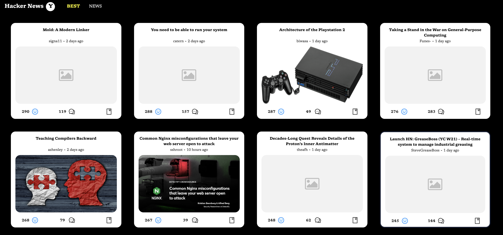

# Hacker News ReadUI

This project build to help other programers can easily read hacker news page with nicer UI / UX



## Technical Main Stacks (This web app using SSR)

- Typescript
- React JS
- Express Framework
- Cheerio
- Antd Design Components
- Heroku For Deployment

## Run Locally

First You need to install dependencies

- Using yarn

```javascript
yarn
```

- Using npm

```javascript
npm install
```

Second just run on dev env following syntax belows

- Using yarn

```javascript
yarn dev
```

- Using npm

```javascript
npm run dev
```

## Build

- Using yarn

```javascript
yarn build
```

- Using npm

```javascript
npm run build
```

## Future Plans

- User can bookmark the favorite articles
- User can read the comments
- User can know what articles be read before
- User can sync up with some favorite tools: Notion, Evernote, etc, ...

## Conclusion

I am still in development stage so it will have some UI bugs also the performance may need to improve a lot in the near future
